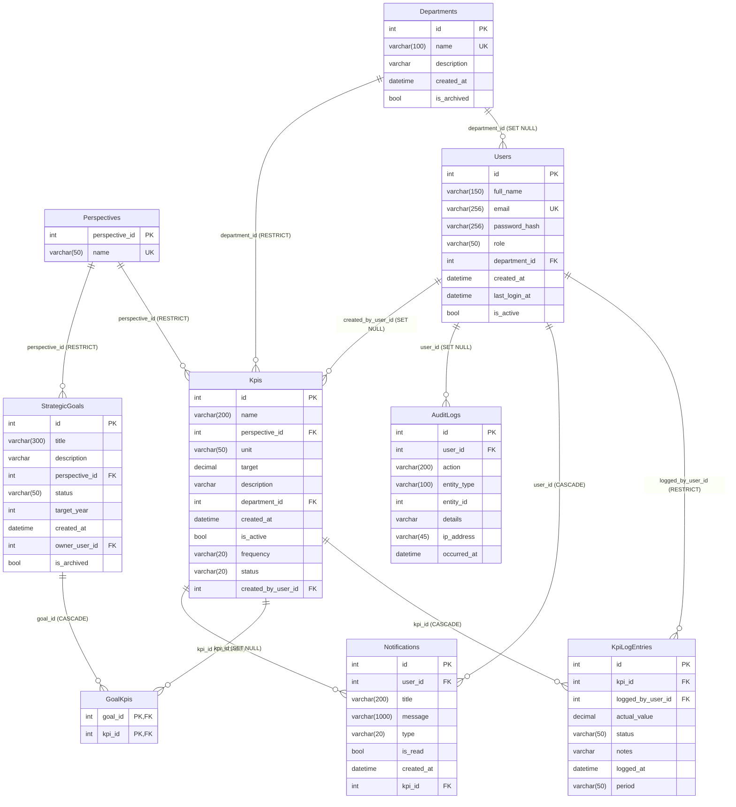

# Design Document: ERD Data Model Alignment

## Overview

This feature aligns the PeakMetrics ASP.NET Core 8 MVC codebase to the ERD and data dictionary defined in the IT15 1st Deliverables document. The changes are purely structural — no new user-facing features are introduced. The goal is to normalize perspective values into a reference table, introduce a many-to-many goal-KPI relationship, add missing KPI fields, replace `DueDate` with `TargetYear`, consolidate notification type metadata, and rename role values — all while preserving existing data through a safe, reversible EF Core migration.

The scope touches the data layer (models, `AppDbContext`, migration), the application layer (controller logic, role constants), and the presentation layer (ViewModels, Razor views).

---

## Architecture

The application follows a standard ASP.NET Core MVC layered architecture:

```
┌─────────────────────────────────────────────────────────┐
│  Presentation Layer                                     │
│  Razor Views (.cshtml) + ViewModels                     │
├─────────────────────────────────────────────────────────┤
│  Application Layer                                      │
│  HomeController.cs (single controller, role-routed)     │
├─────────────────────────────────────────────────────────┤
│  Data Layer                                             │
│  AppDbContext (EF Core) + Models + Migrations           │
├─────────────────────────────────────────────────────────┤
│  Database                                               │
│  SQL Server (via EF Core Code-First)                    │
└─────────────────────────────────────────────────────────┘
```

All schema changes are applied through a single EF Core migration named `ErdAlignment`. The migration must be data-preserving: it populates new FK columns from existing string values before dropping the old columns.

The change set is self-contained within the existing project structure. No new projects, packages, or infrastructure components are required.

---

## Components and Interfaces

### New Model: `Perspective`

```csharp
// Models/Perspective.cs
namespace PeakMetrics.Web.Models;

public sealed class Perspective
{
    public int    Id   { get; set; }
    public string Name { get; set; } = string.Empty;

    // Navigation (reverse)
    public ICollection<Kpi>           Kpis  { get; set; } = new List<Kpi>();
    public ICollection<StrategicGoal> Goals { get; set; } = new List<StrategicGoal>();
}
```

### New Join Entity: `GoalKpi`

```csharp
// Models/GoalKpi.cs
namespace PeakMetrics.Web.Models;

public sealed class GoalKpi
{
    public int GoalId { get; set; }
    public int KpiId  { get; set; }

    // Navigation
    public StrategicGoal Goal { get; set; } = null!;
    public Kpi           Kpi  { get; set; } = null!;
}
```

### Updated Model: `Kpi`

Changes from current state:
- Remove `string Perspective` → add `int PerspectiveId` + `Perspective Perspective` navigation
- Add `string Frequency` (default `"Monthly"`)
- Add `string Status` (default `"On Track"`)
- Add `int? CreatedByUserId` + `AppUser? CreatedBy` navigation
- Add `ICollection<StrategicGoal> LinkedGoals` navigation (via `GoalKpi`)

### Updated Model: `StrategicGoal`

Changes from current state:
- Remove `string Perspective` → add `int PerspectiveId` + `Perspective Perspective` navigation
- Remove `DateTime? DueDate` → add `int? TargetYear`
- Add `ICollection<Kpi> LinkedKpis` navigation (via `GoalKpi`)

### Updated Model: `Notification`

Changes from current state:
- Remove `string Severity`
- Remove `string Icon`
- Add `string Type` (default `"Info"`, values: `Alert` | `Info` | `Warning`)
- Add `int? KpiId` + `Kpi? Kpi` navigation

### Updated Model: `AppUser`

Changes from current state:
- Default value of `Role` changes from `"User"` to `"Staff"`

### Updated `AppDbContext`

New `DbSet` properties:
```csharp
public DbSet<Perspective> Perspectives => Set<Perspective>();
public DbSet<GoalKpi>     GoalKpis     => Set<GoalKpi>();
```

`OnModelCreating` additions and changes are detailed in the Data Models section.

### Updated `HomeController`

Role constant changes:
```csharp
// Before                          After
private const string RoleAdmin = "Admin";   →  private const string RoleAdmin = "Super Admin";
// Add:
private const string RoleStaff = "Staff";
```

All `HasAccess(...)` calls, `CanManageKpis()`, and the `Dashboard` switch must replace `"Admin"` with `"Super Admin"` and `"User"` with `"Staff"`.

Notification creation in `KPILogEntry` POST:
```csharp
// Before
Severity = computedStatus == StatusBehind ? "Critical" : "Warning",
Icon     = computedStatus == StatusBehind ? "bi-x-circle" : "bi-exclamation-triangle",

// After
Type  = computedStatus == StatusBehind ? "Alert" : "Warning",
KpiId = model.KpiId,
```

`PopulateQuickNotificationsAsync` must map `n.Type` to `AlertSeverity` and derive the icon from `Type` instead of reading `n.Icon` and `n.Severity`.

KPI queries that filter or group by `k.Perspective` (string) must be updated to join through `k.Perspective.Name` after including the navigation property.

### Updated ViewModels

| ViewModel | Change |
|---|---|
| `NotificationItemViewModel` | Remove `Icon` + `Severity`; add `Type` (string) |
| `KpiFormViewModel` | Replace `string Perspective` with `int PerspectiveId`; add `Perspectives` dropdown list |
| `KpiManagementItemViewModel` | `Perspective` property remains string (populated from `k.Perspective.Name`) |
| `KpiTrackingItemViewModel` | `Perspective` property remains string (populated from navigation) |
| `KpiRowViewModel` | `Perspective` property remains string (populated from navigation) |
| `StrategicGoalCardViewModel` | Replace `string? DueDate` with `int? TargetYear`; `Perspective` remains string |
| `StrategicGoalFormViewModel` | Replace `string Perspective` with `int PerspectiveId` + `Perspectives` list; replace `DateTime? DueDate` with `int? TargetYear` |
| `StrategicGoalRowViewModel` | Replace `string? DueDate` with `int? TargetYear` |
| `ScorecardPerspectiveViewModel` | `Perspective` property remains string |
| `BscPerspectiveViewModel` | `Perspective` property remains string |

> **Design decision**: ViewModels that are purely display-oriented keep `string Perspective` populated from the navigation property name. Only form ViewModels that accept user input switch to `int PerspectiveId` with a dropdown list populated from the `Perspectives` table.

### Updated Views

| View | Change |
|---|---|
| `KpiForm.cshtml` | Perspective `<select>` binds to `PerspectiveId` (int), options loaded from `Model.Perspectives` |
| `StrategicGoalForm.cshtml` | Perspective `<select>` binds to `PerspectiveId`; date picker replaced with `<input type="number">` for `TargetYear` |
| `StrategicPlanning.cshtml` | `goal.DueDate` → `goal.TargetYear?.ToString()` |
| `Notifications.cshtml` | Icon and severity CSS derived from `item.Type` via a local mapping function |
| `KPITracking.cshtml` | No structural change; `Perspective` string already rendered correctly |
| `BalancedScorecard.cshtml` | No structural change; `group.Perspective` string already rendered correctly |
| `_ManagerDashboard.cshtml` | `goal.DueDate` → `goal.TargetYear?.ToString()` |
| `_ExecutiveDashboard.cshtml` | No structural change; perspective string already rendered correctly |
| `_StaffDashboard.cshtml` | No structural change; perspective string already rendered correctly |

---

## Data Models

### Entity Relationship Diagram (after alignment)



### Seed Data

**Perspectives** (stable IDs required for FK seed data):

| Id | Name |
|---|---|
| 1 | Financial |
| 2 | Customer |
| 3 | Internal Process |
| 4 | Learning & Growth |

**KPI PerspectiveId mapping** (from existing seed data):

| KPI | Old Perspective string | New PerspectiveId |
|---|---|---|
| Revenue Growth Rate | Financial | 1 |
| Net Profit Margin | Financial | 1 |
| Employee Turnover Rate | Learning & Growth | 4 |
| Training Hours per Staff | Learning & Growth | 4 |
| Sales Conversion Rate | Customer | 2 |
| Customer Satisfaction | Customer | 2 |
| Process Cycle Time | Internal Process | 3 |
| Defect Rate | Internal Process | 3 |

**Role value changes** (seed data):

| User | Old Role | New Role |
|---|---|---|
| System Admin (Id=1) | Admin | Super Admin |
| Sarah Johnson (Id=3) | User | Staff |
| Michael Chen (Id=4) | User | Staff |
| Emily Davis (Id=5) | User | Staff |

### `AppDbContext.OnModelCreating` Fluent API Changes

```csharp
// NEW: Perspective entity
modelBuilder.Entity<Perspective>(e =>
{
    e.HasKey(p => p.Id);
    e.Property(p => p.Name).HasMaxLength(50).IsRequired();
    e.HasIndex(p => p.Name).IsUnique();
});

// NEW: Perspective seed data
modelBuilder.Entity<Perspective>().HasData(
    new Perspective { Id = 1, Name = "Financial" },
    new Perspective { Id = 2, Name = "Customer" },
    new Perspective { Id = 3, Name = "Internal Process" },
    new Perspective { Id = 4, Name = "Learning & Growth" }
);

// UPDATED: Kpi entity
modelBuilder.Entity<Kpi>(e =>
{
    // Remove: e.Property(k => k.Perspective).HasMaxLength(100).IsRequired();
    e.Property(k => k.Frequency).HasMaxLength(20).IsRequired();
    e.Property(k => k.Status).HasMaxLength(20).IsRequired();

    e.HasOne(k => k.Perspective)
     .WithMany(p => p.Kpis)
     .HasForeignKey(k => k.PerspectiveId)
     .OnDelete(DeleteBehavior.Restrict);

    e.HasOne(k => k.CreatedBy)
     .WithMany()
     .HasForeignKey(k => k.CreatedByUserId)
     .OnDelete(DeleteBehavior.SetNull);
});

// NEW: GoalKpi join entity
modelBuilder.Entity<GoalKpi>(e =>
{
    e.HasKey(gk => new { gk.GoalId, gk.KpiId });

    e.HasOne(gk => gk.Goal)
     .WithMany()
     .HasForeignKey(gk => gk.GoalId)
     .OnDelete(DeleteBehavior.Cascade);

    e.HasOne(gk => gk.Kpi)
     .WithMany()
     .HasForeignKey(gk => gk.KpiId)
     .OnDelete(DeleteBehavior.Cascade);
});

// Configure many-to-many navigation on StrategicGoal and Kpi
modelBuilder.Entity<StrategicGoal>()
    .HasMany(g => g.LinkedKpis)
    .WithMany(k => k.LinkedGoals)
    .UsingEntity<GoalKpi>();

// UPDATED: StrategicGoal entity
modelBuilder.Entity<StrategicGoal>(e =>
{
    // Remove: e.Property(g => g.Perspective).HasMaxLength(100).IsRequired();
    e.HasOne(g => g.Perspective)
     .WithMany(p => p.Goals)
     .HasForeignKey(g => g.PerspectiveId)
     .OnDelete(DeleteBehavior.Restrict);
});

// UPDATED: Notification entity
modelBuilder.Entity<Notification>(e =>
{
    // Remove: e.Property(n => n.Severity).HasMaxLength(50).IsRequired();
    // Remove: e.Property(n => n.Icon).HasMaxLength(100).IsRequired();
    e.Property(n => n.Type).HasMaxLength(20).IsRequired();

    e.HasOne(n => n.Kpi)
     .WithMany()
     .HasForeignKey(n => n.KpiId)
     .OnDelete(DeleteBehavior.SetNull);
});
```

### Migration Strategy (`ErdAlignment`)

The migration `Up()` method must execute steps in dependency order:

1. **Create `Perspectives` table** and insert the four seed rows.
2. **Add `Kpis.PerspectiveId`** as nullable initially; populate from the existing `Perspective` string using a raw SQL `UPDATE` with a `CASE` expression; then alter to NOT NULL.
3. **Drop `Kpis.Perspective`** string column.
4. **Add `Kpis.Frequency`** (NOT NULL, default `'Monthly'`), **`Kpis.Status`** (NOT NULL, default `'On Track'`), **`Kpis.CreatedByUserId`** (nullable FK).
5. **Add `StrategicGoals.PerspectiveId`** as nullable; populate from existing `Perspective` string; alter to NOT NULL.
6. **Drop `StrategicGoals.Perspective`** string column.
7. **Add `StrategicGoals.TargetYear`** (nullable int); populate from `YEAR(DueDate)` where `DueDate IS NOT NULL`.
8. **Drop `StrategicGoals.DueDate`** column.
9. **Create `GoalKpis`** table with composite PK and FKs.
10. **Add `Notifications.Type`** (NOT NULL, default `'Info'`); populate from `Severity` using mapping `Critical → Alert`, `Warning → Warning`, `Standard → Info`.
11. **Drop `Notifications.Severity`** and **`Notifications.Icon`** columns.
12. **Add `Notifications.KpiId`** (nullable FK → `Kpis.Id`, SET NULL on delete).
13. **Update `Users.Role`** seed data: `Admin → Super Admin`, `User → Staff`.

The migration `Down()` method reverses all steps in reverse order, restoring dropped columns with their original data where possible (e.g., re-deriving `DueDate` from `TargetYear` as `DATEFROMPARTS(TargetYear, 1, 1)`, re-deriving `Severity`/`Icon` from `Type`).

---

## Correctness Properties

*A property is a characteristic or behavior that should hold true across all valid executions of a system — essentially, a formal statement about what the system should do. Properties serve as the bridge between human-readable specifications and machine-verifiable correctness guarantees.*

### Property 1: Perspective FK restricts deletion when referenced

*For any* `Perspective` row that is referenced by at least one `Kpi` or `StrategicGoal`, attempting to delete that `Perspective` should throw a referential integrity exception and leave the `Perspective` row intact.

**Validates: Requirements 1.5**

---

### Property 2: KPI and StrategicGoal perspective navigation resolves correctly

*For any* `Kpi` or `StrategicGoal` with a valid `PerspectiveId`, querying the entity with the `Perspective` navigation property included should return a non-null `Perspective` whose `Name` matches the name of the seeded perspective with that ID.

**Validates: Requirements 2.4, 2.6, 3.4**

---

### Property 3: GoalKpis cascade-delete from StrategicGoal side

*For any* `StrategicGoal` that has one or more linked `Kpi` entries in `GoalKpis`, deleting that `StrategicGoal` should result in all corresponding `GoalKpis` rows being removed, with the linked `Kpi` records remaining intact.

**Validates: Requirements 4.3**

---

### Property 4: GoalKpis cascade-delete from Kpi side

*For any* `Kpi` that has one or more linked `StrategicGoal` entries in `GoalKpis`, deleting that `Kpi` should result in all corresponding `GoalKpis` rows being removed, with the linked `StrategicGoal` records remaining intact.

**Validates: Requirements 4.4**

---

### Property 5: Kpi.CreatedByUserId set-null on user deletion

*For any* `Kpi` with a non-null `CreatedByUserId`, deleting the referenced `AppUser` should result in `Kpi.CreatedByUserId` becoming `null`, with the `Kpi` record otherwise unchanged.

**Validates: Requirements 5.4**

---

### Property 6: TargetYear validation accepts valid range and rejects invalid values

*For any* integer value provided as `TargetYear`, the model validation should pass if and only if the value is `null` or falls within the inclusive range `[2000, 2100]`. Any non-null value outside this range should produce a validation error.

**Validates: Requirements 6.6**

---

### Property 7: Notification.Type mapping is deterministic and complete

*For any* KPI log entry status value (`Behind`, `At Risk`, or any other), the notification `Type` assigned by the controller should be exactly `"Alert"` when the status is `Behind`, exactly `"Warning"` when the status is `"At Risk"`, and exactly `"Info"` for all other statuses. Furthermore, *for any* `Notification.Type` value, the view's derived icon class and color should match the defined mapping (`Alert` → danger/red, `Warning` → warning/yellow, `Info` → info/blue) with no unmapped cases.

**Validates: Requirements 7.5, 7.6, 7.7, 7.8**

---

### Property 8: Notification.KpiId set-null on KPI deletion

*For any* `Notification` with a non-null `KpiId`, deleting the referenced `Kpi` should result in `Notification.KpiId` becoming `null`, with the `Notification` record otherwise unchanged.

**Validates: Requirements 8.2**

---

### Property 9: Role-based access control uses updated role names

*For any* role string and any set of allowed roles passed to `HasAccess(...)`, the method should return `true` if and only if the role string is contained in the allowed set. Specifically, `"Super Admin"` must grant access wherever `"Admin"` previously did, `"Staff"` must grant access wherever `"User"` previously did, and the legacy strings `"Admin"` and `"User"` must no longer grant access to any protected action.

**Validates: Requirements 9.1, 9.4**

---

## Error Handling

### Migration Failures

- The migration uses a step-by-step approach: new nullable columns are added and populated before being altered to NOT NULL. This prevents constraint violations during migration.
- If the migration is applied to a database that already has the `Perspectives` table (e.g., partial re-run), the `Up()` method should guard with `migrationBuilder.Sql("IF NOT EXISTS (...) CREATE TABLE ...")` or rely on EF Core's idempotency checks.
- The `Down()` method restores `DueDate` as `DATEFROMPARTS(TargetYear, 1, 1, 0, 0, 0)` where `TargetYear IS NOT NULL`, and restores `Severity`/`Icon` from `Type` using the reverse mapping.

### Perspective FK Violations

- `OnDelete(DeleteBehavior.Restrict)` on both `Kpi.PerspectiveId` and `StrategicGoal.PerspectiveId` means EF Core will throw a `DbUpdateException` if a perspective deletion is attempted while it is still referenced. The UI does not expose a perspective delete action, so this is a defensive constraint only.

### Notification.KpiId and Kpi.CreatedByUserId Null Handling

- Both are nullable FKs with `SetNull` delete behavior. After the referenced entity is deleted, the FK column becomes `null`. All code that reads these properties must handle the `null` case (e.g., `notification.Kpi?.Name ?? "—"`).

### TargetYear Validation

- The `StrategicGoalFormViewModel` uses a `[Range(2000, 2100)]` data annotation on `TargetYear`. The controller checks `ModelState.IsValid` before persisting. The view renders a `<input type="number" min="2000" max="2100">` for client-side feedback.

### Role Transition

- The `Dashboard` action's `switch` statement must include both `"Super Admin"` and `"Staff"` cases. The legacy `"Admin"` and `"User"` strings will no longer match any case and will fall through to the `_ => RedirectToAction(nameof(Login))` default, which is safe.
- The `UserCreate` and `UserEdit` actions currently block assignment of `"Admin"` via the UI. This guard must be updated to block `"Super Admin"` instead.

### Notification Type Derivation

- The `PopulateQuickNotificationsAsync` helper currently reads `n.Icon` and `n.Severity` directly. After the migration, it must derive the icon and `AlertSeverity` from `n.Type` using a static mapping method:

```csharp
private static (string Icon, AlertSeverity Severity) FromNotificationType(string type) => type switch
{
    "Alert"   => ("bi-x-circle",            AlertSeverity.Critical),
    "Warning" => ("bi-exclamation-triangle", AlertSeverity.Warning),
    _         => ("bi-info-circle",          AlertSeverity.Standard)
};
```

---

## Testing Strategy

### Unit Tests

Unit tests should cover specific examples and edge cases that are not addressed by property-based tests:

- **Seed data correctness**: Verify that the four `Perspective` rows are seeded with the correct IDs and names.
- **KPI seed data FK mapping**: Verify that each of the 8 seeded KPIs has the correct `PerspectiveId`.
- **Role seed data**: Verify that seeded users have the updated role values (`Super Admin`, `Staff`).
- **Dashboard routing**: Verify that each of the five role values routes to the correct dashboard builder (example-based, one test per role).
- **Notification KpiId population**: Verify that a KPI-triggered notification has `KpiId` set to the triggering KPI's ID.
- **Non-KPI notification KpiId**: Verify that a non-KPI notification has `KpiId = null`.
- **TargetYear display rendering**: Verify that `TargetYear = 2026` renders as `"2026"` and `TargetYear = null` renders as an empty/absent string.

### Property-Based Tests

The project uses **xUnit** with **FsCheck** (or **CsCheck**) as the property-based testing library. Each property test runs a minimum of **100 iterations**.

Each test is tagged with a comment in the format:
`// Feature: erd-data-model-alignment, Property {N}: {property_text}`

**Property 1** — Perspective FK restricts deletion when referenced
- Generator: random `Perspective` + at least one `Kpi` or `StrategicGoal` referencing it
- Assertion: `DbUpdateException` is thrown on `SaveChangesAsync` after `_db.Perspectives.Remove(perspective)`

**Property 2** — KPI and StrategicGoal perspective navigation resolves correctly
- Generator: random `PerspectiveId` in `[1, 4]`; create a `Kpi` or `StrategicGoal` with that ID
- Assertion: `entity.Perspective.Name == expectedName` after `Include(e => e.Perspective)`

**Property 3** — GoalKpis cascade-delete from StrategicGoal side
- Generator: random `StrategicGoal` with 1–5 linked `Kpi` entries
- Assertion: after deleting the goal, `_db.GoalKpis.Count(gk => gk.GoalId == goalId) == 0` and all linked `Kpi` records still exist

**Property 4** — GoalKpis cascade-delete from Kpi side
- Generator: random `Kpi` with 1–5 linked `StrategicGoal` entries
- Assertion: after deleting the KPI, `_db.GoalKpis.Count(gk => gk.KpiId == kpiId) == 0` and all linked `StrategicGoal` records still exist

**Property 5** — Kpi.CreatedByUserId set-null on user deletion
- Generator: random `AppUser` + random `Kpi` with `CreatedByUserId = user.Id`
- Assertion: after deleting the user, `kpi.CreatedByUserId == null`

**Property 6** — TargetYear validation accepts valid range and rejects invalid values
- Generator: random integers (full int range, including negatives and values > 2100)
- Assertion: `ModelState.IsValid == (value >= 2000 && value <= 2100)` for non-null values; `null` always passes

**Property 7** — Notification.Type mapping is deterministic and complete
- Generator: random KPI status strings (including arbitrary strings beyond the three known values)
- Assertion for controller mapping: `Type == "Alert"` iff `status == "Behind"`, `Type == "Warning"` iff `status == "At Risk"`, `Type == "Info"` otherwise
- Assertion for view mapping: `FromNotificationType(type)` returns a non-null icon and a valid `AlertSeverity` for any input; the three defined types map to their specified values

**Property 8** — Notification.KpiId set-null on KPI deletion
- Generator: random `Kpi` + random `Notification` with `KpiId = kpi.Id`
- Assertion: after deleting the KPI, `notification.KpiId == null`

**Property 9** — Role-based access control uses updated role names
- Generator: random role strings (including legacy `"Admin"`, `"User"`, and arbitrary strings)
- Assertion: `HasAccess("Super Admin")` returns `true` iff `role == "Super Admin"`; `HasAccess("Staff")` returns `true` iff `role == "Staff"`; `HasAccess("Admin")` always returns `false` (legacy string no longer valid)

### Integration Tests

- **Migration round-trip**: Apply `ErdAlignment` to a test database, verify schema state (table existence, column types, FK constraints), then roll back and verify the schema is restored.
- **Data preservation**: Seed a test database with the pre-migration schema, apply the migration, and verify that `PerspectiveId` values are correctly mapped from the old string values and that `TargetYear` is correctly derived from `DueDate`.
