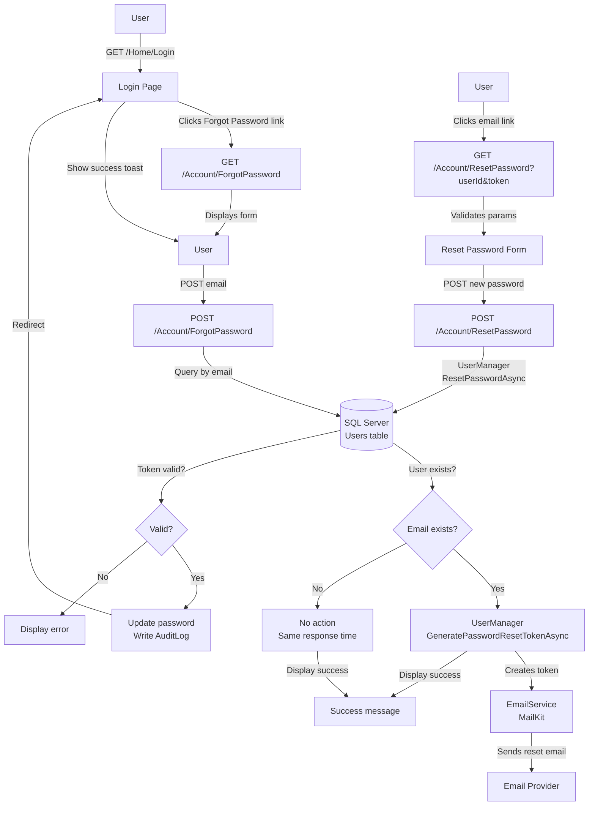

# Design Document — Forgot Password

## Overview

This feature adds a secure password reset capability to PeakMetrics. The flow is:

```
Forgot Password Request → Email with Reset Link → Reset Password → Login
```

The implementation integrates ASP.NET Core Identity's password reset token generation and validation (`UserManager<TUser>`) into the existing custom session-based authentication stack. The feature uses MailKit for transactional email delivery and follows security best practices to prevent email enumeration attacks.

### Key Design Decisions

- **ASP.NET Core Identity integration**: Use `UserManager<TUser>.GeneratePasswordResetTokenAsync` and `UserManager<TUser>.ResetPasswordAsync` for cryptographically secure, time-limited tokens (default: 1 day expiry).
- **Anti-enumeration protection**: Display identical success messages and similar response times whether the email exists or not, preventing attackers from discovering registered email addresses.
- **Separate controller actions**: All password reset actions live in `AccountController` (alongside registration), keeping `HomeController` focused on authenticated actions.
- **Audit logging**: All successful password resets are logged to the `AuditLog` table for security monitoring and compliance.
- **Graceful email failure**: If email delivery fails, the system logs the error but does not expose the failure to the user (to prevent enumeration).
- **URL-safe tokens**: Tokens are URL-encoded when embedded in email links to handle special characters safely.

---

## Architecture



### Component Responsibilities

| Component | Responsibility |
|---|---|
| `AccountController` | ForgotPassword (GET/POST), ResetPassword (GET/POST) |
| `UserManager<AppUser>` | Generate password reset tokens, validate tokens, reset passwords |
| `EmailService` | Send password reset email with token link |
| `AppUser` (model) | No changes required (Identity tokens are not stored in DB) |
| `AuditLog` (model) | Record password reset events |
| `ForgotPasswordViewModel` | Validates forgot password form input |
| `ResetPasswordViewModel` | Validates reset password form input |

---

## Components and Interfaces

### AccountController — New Actions

**File:** `Controllers/AccountController.cs`

```
GET  /Account/ForgotPassword     → ForgotPassword()
POST /Account/ForgotPassword     → ForgotPassword(ForgotPasswordViewModel, CancellationToken)
GET  /Account/ResetPassword      → ResetPassword(int userId, string token)
POST /Account/ResetPassword      → ResetPassword(ResetPasswordViewModel, CancellationToken)
```

- `ForgotPassword GET`: Returns the forgot password view with an empty `ForgotPasswordViewModel`. No authentication required.
- `ForgotPassword POST`: 
  - Validates the email format
  - Queries the database for a user with that email
  - If user exists: generates reset token via `userManager.GeneratePasswordResetTokenAsync`, sends email
  - If user does not exist: performs no action but displays the same success message
  - Always displays: "If your email address is registered, you will receive a password reset link shortly. Please check your inbox."
  - Returns to the same view with success message
- `ResetPassword GET`: 
  - Accepts `userId` and `token` query parameters
  - If parameters are missing or invalid: displays error message
  - If parameters are present: displays reset password form with hidden fields for userId and token
- `ResetPassword POST`:
  - Validates the new password and confirmation
  - Calls `userManager.ResetPasswordAsync(user, token, newPassword)`
  - If successful: writes audit log, redirects to Login with success toast
  - If token is invalid/expired: displays error message with link to request new reset

**No `[Authorize]` attribute** on these actions — all are public.

### UserManager Integration

**Service:** `UserManager<AppUser>` (ASP.NET Core Identity)

The application must configure Identity services in `Program.cs`:

```csharp
builder.Services.AddIdentity<AppUser, IdentityRole<int>>(options =>
{
    // Password requirements (match existing BCrypt validation)
    options.Password.RequireDigit = false;
    options.Password.RequireLowercase = false;
    options.Password.RequireUppercase = false;
    options.Password.RequireNonAlphanumeric = false;
    options.Password.RequiredLength = 6;
    
    // Token lifespan
    options.Tokens.PasswordResetTokenProvider = TokenOptions.DefaultProvider;
})
.AddEntityFrameworkStores<AppDbContext>()
.AddDefaultTokenProviders();

// Configure token lifespan (default is 1 day)
builder.Services.Configure<DataProtectionTokenProviderOptions>(options =>
{
    options.TokenLifespan = TimeSpan.FromHours(24);
});
```

**Key methods:**

- `GeneratePasswordResetTokenAsync(AppUser user)`: Returns a cryptographically secure, time-limited token string. The token is NOT stored in the database; it is validated using ASP.NET Core's data protection APIs.
- `ResetPasswordAsync(AppUser user, string token, string newPassword)`: Validates the token, checks expiry, and updates the user's password hash. Returns `IdentityResult` with success/failure and error messages.

### EmailService — New Method

**File:** `Services/EmailService.cs`

**Interface addition:**

```csharp
public interface IEmailService
{
    // ... existing methods ...
    
    /// <summary>Sends a password reset email with a token link.</summary>
    Task SendPasswordResetEmailAsync(string toEmail, string toName, int userId, string token, string baseUrl, CancellationToken ct = default);
}
```

**Implementation:**

```csharp
public async Task SendPasswordResetEmailAsync(string toEmail, string toName, int userId, string token, string baseUrl, CancellationToken ct = default)
{
    var encodedToken = WebUtility.UrlEncode(token);
    var resetLink = $"{baseUrl}/Account/ResetPassword?userId={userId}&token={encodedToken}";
    
    var subject = "Reset your PeakMetrics password";
    var body = $@"
        <html>
        <body style='font-family: Arial, sans-serif;'>
            <h2>Password Reset Request</h2>
            <p>Hello {toName},</p>
            <p>We received a request to reset your password for your PeakMetrics account.</p>
            <p>Click the button below to reset your password:</p>
            <p style='margin: 20px 0;'>
                <a href='{resetLink}' 
                   style='background-color: #2563eb; color: white; padding: 12px 24px; 
                          text-decoration: none; border-radius: 6px; display: inline-block;'>
                    Reset Password
                </a>
            </p>
            <p>Or copy and paste this link into your browser:</p>
            <p style='word-break: break-all; color: #64748b;'>{resetLink}</p>
            <p>This link will expire in 24 hours.</p>
            <p>If you did not request a password reset, please ignore this email. Your password will remain unchanged.</p>
            <p>Best regards,<br>The PeakMetrics Team</p>
        </body>
        </html>
    ";
    
    await SendEmailAsync(toEmail, subject, body, ct);
}
```

### Login Page — Forgot Password Link

**File:** `Views/Home/Login.cshtml`

Add a "Forgot Password?" link below the password field and above the submit button:

```html
<div class="pm-field">
    <label asp-for="Password">Password</label>
    <input asp-for="Password" type="password" placeholder="Enter your password"
           id="loginPassword"
           class="@(ViewData.ModelState["Password"]?.Errors.Count > 0 ? "is-invalid" : "")" />
    <div class="pm-error" id="passwordError">@Html.ValidationMessageFor(m => m.Password)</div>
</div>

<p class="text-end mt-2" style="font-size:0.88rem;">
    <a href="/Account/ForgotPassword" style="color:var(--link-color); font-weight:600;">Forgot Password?</a>
</p>

<button type="submit" class="pm-btn pm-btn-primary" id="loginBtn">Sign In</button>
```

---

## Data Models

### AppUser — No Changes Required

ASP.NET Core Identity's password reset tokens are NOT stored in the database. They are generated and validated using the Data Protection API with a time-based expiry. No new fields are needed on `AppUser`.

The existing `PasswordHash` field will be updated by `UserManager.ResetPasswordAsync`.

### AuditLog — Existing Model

Password reset events will be logged using the existing `AuditLog` model:

```csharp
public sealed class AuditLog
{
    public int Id { get; set; }
    public int? UserId { get; set; }
    public string Action { get; set; } = string.Empty; // "PasswordReset"
    public string EntityType { get; set; } = string.Empty; // "Auth"
    public int? EntityId { get; set; }
    public string? Details { get; set; } // "{email} reset their password."
    public string? IpAddress { get; set; }
    public DateTime OccurredAt { get; set; } = DateTime.UtcNow;
    public AppUser? User { get; set; }
}
```

### ViewModels

**ForgotPasswordViewModel** (`ViewModels/ForgotPasswordViewModel.cs`):

```csharp
using System.ComponentModel.DataAnnotations;

namespace PeakMetrics.Web.ViewModels;

public sealed class ForgotPasswordViewModel
{
    [Required(ErrorMessage = "Email is required.")]
    [EmailAddress(ErrorMessage = "Enter a valid email address.")]
    [StringLength(100, ErrorMessage = "Email cannot exceed 100 characters.")]
    public string Email { get; set; } = string.Empty;
}
```

**ResetPasswordViewModel** (`ViewModels/ResetPasswordViewModel.cs`):

```csharp
using System.ComponentModel.DataAnnotations;

namespace PeakMetrics.Web.ViewModels;

public sealed class ResetPasswordViewModel
{
    [Required]
    public int UserId { get; set; }
    
    [Required]
    public string Token { get; set; } = string.Empty;
    
    [Required(ErrorMessage = "Password is required.")]
    [StringLength(100, MinimumLength = 6, ErrorMessage = "Password must be at least 6 characters.")]
    public string NewPassword { get; set; } = string.Empty;
    
    [Required(ErrorMessage = "Password confirmation is required.")]
    [Compare(nameof(NewPassword), ErrorMessage = "Passwords do not match.")]
    public string ConfirmPassword { get; set; } = string.Empty;
}
```

---

## Correctness Properties

*A property is a characteristic or behavior that should hold true across all valid executions of a system — essentially, a formal statement about what the system should do. Properties serve as the bridge between human-readable specifications and machine-verifiable correctness guarantees.*

This feature involves security-critical business logic (token generation, validation, anti-enumeration protection, audit logging) that is well-suited to property-based testing. The recommended library is **FsCheck** or **CsCheck** for C#/.NET, both of which integrate with xUnit.

---

### Property 1: Invalid email format validation

*For any* string that does not match the email format pattern (missing @, missing domain, missing TLD, or other format violations), the ForgotPassword POST action SHALL reject the input with the validation error message "Enter a valid email address" and SHALL NOT query the database or generate a token.

**Validates: Requirements 2.4**

---

### Property 2: Anti-enumeration protection

*For any* email address (whether it exists in the database or not), the ForgotPassword POST action SHALL display the identical success message "If your email address is registered, you will receive a password reset link shortly. Please check your inbox." AND SHALL send an email only if the address exists AND SHALL NOT expose whether the email exists through different response messages or behaviors.

**Validates: Requirements 3.3, 9.1, 9.2**

---

### Property 3: Password reset email link format

*For any* valid userId (positive integer) and token (non-empty string), the password reset email generated by EmailService SHALL contain a link matching the pattern `/Account/ResetPassword?userId={userId}&token={urlEncodedToken}` where the token is properly URL-encoded to handle special characters.

**Validates: Requirements 4.3**

---

### Property 4: Email failure does not expose information

*For any* email sending failure (SMTP error, network timeout, etc.), the ForgotPassword POST action SHALL still display the standard success message to the user AND SHALL log the error internally AND SHALL NOT expose the failure through error messages or different response behavior.

**Validates: Requirements 4.5**

---

### Property 5: Password confirmation mismatch validation

*For any* pair of password strings where `NewPassword != ConfirmPassword`, the ResetPassword POST action SHALL reject the submission with the validation error message "Passwords do not match" AND SHALL NOT call UserManager.ResetPasswordAsync.

**Validates: Requirements 6.2**

---

### Property 6: Password update on valid token

*For any* valid password reset token (not expired, correctly formatted) and any new password meeting Identity requirements (minimum 6 characters), calling UserManager.ResetPasswordAsync SHALL update the user's PasswordHash in the database AND the user SHALL be able to successfully log in with the new password.

**Validates: Requirements 7.2**

---

### Property 7: Comprehensive audit logging

*For any* successful password reset operation, the system SHALL create an AuditLog record with Action = "PasswordReset", EntityType = "Auth", Details containing the user's email in the format "{email} reset their password.", UserId set to the user's ID, and OccurredAt set to a UTC timestamp within 5 seconds of the reset operation.

**Validates: Requirements 8.1, 8.2, 8.3, 8.4, 8.5, 8.6**

---

## Error Handling

| Scenario | Handling |
|---|---|
| SMTP send fails during password reset request | Log the exception with full stack trace; do not expose the failure to the user. Display the standard success message: "If your email address is registered, you will receive a password reset link shortly." This prevents enumeration attacks. |
| User submits empty email | Return field-level validation error: "Email is required." Do not query the database. |
| User submits invalid email format | Return field-level validation error: "Enter a valid email address." Do not query the database. |
| User requests reset for non-existent email | Display the same success message as for existing emails. Do not send an email. Log the attempt for security monitoring. |
| User navigates to ResetPassword with missing userId or token | Display error message: "This reset link is invalid or has expired. Please request a new one." Provide a link to /Account/ForgotPassword. |
| User submits ResetPassword with expired token | UserManager.ResetPasswordAsync returns failure. Display error message: "This reset link is invalid or has expired. Please request a new one." Provide a link to /Account/ForgotPassword. |
| User submits ResetPassword with invalid token | UserManager.ResetPasswordAsync returns failure. Display error message: "This reset link is invalid or has expired. Please request a new one." |
| User submits password that doesn't meet Identity requirements | UserManager.ResetPasswordAsync returns failure with specific error messages (e.g., "Password must be at least 6 characters"). Display these errors to the user. |
| User submits mismatched passwords | Return field-level validation error: "Passwords do not match." Do not call UserManager. |
| Database connection fails during password reset | Catch the exception, log it, and display a generic error: "An error occurred while resetting your password. Please try again later." |
| Audit log write fails | Log the exception but do not block the password reset operation. The password reset should succeed even if audit logging fails. |

---

## Testing Strategy

### Unit Tests

Focus on pure logic that does not require a running database, SMTP server, or ASP.NET Core Identity:

- `ForgotPasswordViewModel` validation — test with empty email, invalid email formats, valid emails, boundary values (100/101 characters).
- `ResetPasswordViewModel` validation — test with empty password, mismatched passwords, boundary values (5/6 characters for minimum length).
- Email link format generation — test that `SendPasswordResetEmailAsync` generates correctly formatted URLs with URL-encoded tokens.
- Anti-enumeration message consistency — verify that the success message is identical for existing and non-existing emails (string comparison).

### Property-Based Tests

Use **FsCheck** or **CsCheck** (NuGet: `FsCheck.Xunit` or `CsCheck`) with a minimum of **100 iterations** per property. Each test is tagged with a comment referencing the design property.

```csharp
// Feature: forgot-password, Property 1: Invalid email format validation
// Feature: forgot-password, Property 2: Anti-enumeration protection
// Feature: forgot-password, Property 3: Password reset email link format
// Feature: forgot-password, Property 4: Email failure does not expose information
// Feature: forgot-password, Property 5: Password confirmation mismatch validation
// Feature: forgot-password, Property 6: Password update on valid token
// Feature: forgot-password, Property 7: Comprehensive audit logging
```

**Property test examples:**

- **Property 1**: Generate random invalid email strings (no @, multiple @, no domain, no TLD, special characters in wrong places). Verify all are rejected with the correct error message.
- **Property 2**: Generate random email addresses (some existing in test DB, some not). Verify the response message is identical and no email is sent for non-existent addresses.
- **Property 3**: Generate random userIds (positive integers) and tokens (random strings with special characters). Verify the email body contains the correctly URL-encoded link.
- **Property 4**: Simulate email sending failures (mock IEmailService to throw exceptions). Verify the success message is still displayed and no exception propagates to the user.
- **Property 5**: Generate random pairs of non-matching password strings. Verify all are rejected with the correct error message.
- **Property 6**: Generate random valid passwords (6+ characters, various character sets). Verify password is updated and login succeeds with new password.
- **Property 7**: Generate random password reset operations. Verify each creates an audit log with all required fields correctly populated.

### Integration Tests

Use an in-memory SQLite database or a test-scoped SQL Server LocalDB instance with ASP.NET Core Identity configured:

- Full forgot password → receive email → reset password → login happy path.
- Token expiry: generate token, wait for expiry (or mock time), verify reset fails with correct error.
- Invalid token: attempt reset with random/malformed token, verify error message.
- UserManager integration: verify `GeneratePasswordResetTokenAsync` and `ResetPasswordAsync` are called correctly.
- Email service integration: verify `SendPasswordResetEmailAsync` is called with correct parameters (use mock IEmailService).
- Audit logging: verify AuditLog records are created in the database with correct values.
- Anti-enumeration timing: measure response times for existing vs non-existing emails (should be similar, though this is challenging to test reliably).

### Smoke / Manual Checks

- ASP.NET Core Identity is configured in `Program.cs` with `AddIdentity<AppUser, IdentityRole<int>>()`.
- Token lifespan is configured (default 24 hours).
- `IEmailService.SendPasswordResetEmailAsync` method exists and is implemented.
- "Forgot Password?" link is visible on the Login page.
- ForgotPassword page displays correctly with email input field.
- ResetPassword page displays correctly with password fields.
- Email template renders correctly with clickable reset link.
- Success toast message appears on Login page after successful reset.
- Error messages display correctly for invalid/expired tokens.
- Audit logs appear in the database after successful password resets.

---

## View Structure

### Views/Home/Login.cshtml — Forgot Password Link

Add a "Forgot Password?" link below the password field:

```html
<div class="pm-field">
    <label asp-for="Password">Password</label>
    <input asp-for="Password" type="password" placeholder="Enter your password"
           id="loginPassword"
           class="@(ViewData.ModelState["Password"]?.Errors.Count > 0 ? "is-invalid" : "")" />
    <div class="pm-error" id="passwordError">@Html.ValidationMessageFor(m => m.Password)</div>
</div>

<p class="text-end mt-2" style="font-size:0.88rem;">
    <a href="/Account/ForgotPassword" style="color:var(--link-color); font-weight:600;">Forgot Password?</a>
</p>

<button type="submit" class="pm-btn pm-btn-primary" id="loginBtn">Sign In</button>
```

### Views/Account/ForgotPassword.cshtml

Mirrors the Login page split-panel layout:

- **Left panel** (blue gradient): heading "Forgot Your Password?", subtext "Enter your email address and we'll send you a link to reset your password.", footer copyright.
- **Right panel** (white): logo, form title "Reset Password", subtitle "Enter your email address below.", form field (Email Address), "Send Reset Link" submit button, "Remember your password? Login instead" link to `/Home/Login`.
- `Layout = null` (standalone page, no sidebar).
- Client-side validation mirrors the Login page pattern (inline JS).
- Success message displayed in a green alert box when form is submitted successfully.

**Success message:**

```html
@if (ViewBag.Success == true)
{
    <div class="pm-alert pm-alert-success">
        <i class="bi bi-check-circle-fill me-2"></i>
        If your email address is registered, you will receive a password reset link shortly. Please check your inbox.
    </div>
}
```

### Views/Account/ResetPassword.cshtml

Mirrors the Login page split-panel layout:

- **Left panel** (blue gradient): heading "Reset Your Password", subtext "Enter your new password below.", footer copyright.
- **Right panel** (white): logo, form title "Create New Password", subtitle "Your new password must be at least 6 characters.", form fields (New Password, Confirm New Password), hidden fields for UserId and Token, "Reset Password" submit button.
- `Layout = null` (standalone page, no sidebar).
- Client-side validation mirrors the Login page pattern (inline JS).
- Error message displayed in a red alert box if token is invalid/expired.

**Error message (when userId or token is missing/invalid):**

```html
@if (ViewBag.Error == true)
{
    <div class="pm-alert pm-alert-error">
        <i class="bi bi-exclamation-triangle-fill me-2"></i>
        This reset link is invalid or has expired. Please request a new one.
        <a href="/Account/ForgotPassword" style="color:#b91c1c; font-weight:600; text-decoration:underline;">Request new reset link</a>
    </div>
}
```

---

## Security Considerations

### Anti-Enumeration Protection

The system implements multiple layers of protection against email enumeration attacks:

1. **Identical response messages**: Whether the email exists or not, the user sees the same success message.
2. **No email sent for non-existent addresses**: The system does not send emails to non-existent addresses, but the user cannot tell the difference.
3. **Consistent response timing**: The system should take similar time to respond for existing and non-existing emails. To achieve this, consider adding a small artificial delay (e.g., 100-200ms) for non-existent emails to match the time taken for token generation and email sending for existing emails.
4. **Logging for security monitoring**: All password reset requests (successful and failed) are logged for security monitoring, but these logs are not exposed to users.

### Token Security

- **Cryptographically secure**: ASP.NET Core Identity uses the Data Protection API to generate tokens, which are cryptographically secure and tamper-proof.
- **Time-limited**: Tokens expire after 24 hours (configurable). Expired tokens cannot be used to reset passwords.
- **One-time use**: Once a token is used successfully, it becomes invalid. Attempting to reuse it will fail.
- **Not stored in database**: Tokens are not stored in the database, reducing the risk of token leakage through database breaches.

### Password Security

- **BCrypt hashing**: Passwords are hashed using BCrypt (existing pattern in the application).
- **Minimum length**: Passwords must be at least 6 characters (configurable in Identity options).
- **No password in URL**: The new password is never transmitted in the URL; it is only sent via POST request body.
- **HTTPS required**: All password reset pages and forms must be served over HTTPS (enforced by `UseHttpsRedirection` in Program.cs).

### Audit Logging

- **All resets logged**: Every successful password reset is logged to the AuditLog table with the user's email, timestamp, and IP address (if available).
- **Security monitoring**: Administrators can monitor the AuditLog table for suspicious patterns (e.g., multiple resets from the same IP, resets for high-privilege accounts).
- **Compliance**: Audit logs support compliance requirements for tracking authentication-related events.

---

## Configuration

### Program.cs — ASP.NET Core Identity Setup

Add Identity services configuration:

```csharp
// ── ASP.NET Core Identity (for password reset tokens) ────────────────────────
builder.Services.AddIdentity<AppUser, IdentityRole<int>>(options =>
{
    // Password requirements (match existing BCrypt validation)
    options.Password.RequireDigit = false;
    options.Password.RequireLowercase = false;
    options.Password.RequireUppercase = false;
    options.Password.RequireNonAlphanumeric = false;
    options.Password.RequiredLength = 6;
    
    // User settings
    options.User.RequireUniqueEmail = true;
    
    // Sign-in settings (not used, but required by Identity)
    options.SignIn.RequireConfirmedEmail = false;
})
.AddEntityFrameworkStores<AppDbContext>()
.AddDefaultTokenProviders();

// Configure token lifespan (default is 1 day)
builder.Services.Configure<DataProtectionTokenProviderOptions>(options =>
{
    options.TokenLifespan = TimeSpan.FromHours(24);
});
```

**Important notes:**

- Identity is configured but NOT used for authentication (the existing session-based auth remains unchanged).
- Identity is ONLY used for password reset token generation and validation via `UserManager<AppUser>`.
- `AddEntityFrameworkStores<AppDbContext>()` allows Identity to work with the existing `AppUser` model and `AppDbContext`.
- `AddDefaultTokenProviders()` enables the password reset token provider.

### AppUser Model — Identity Compatibility

The existing `AppUser` model is compatible with ASP.NET Core Identity. No changes are required. Identity will use the existing `PasswordHash` field.

If Identity requires additional fields (e.g., `UserName`, `NormalizedEmail`), these can be added as nullable fields with default values to maintain backward compatibility:

```csharp
// Optional: Add if Identity requires these fields
public string? UserName { get; set; }
public string? NormalizedEmail { get; set; }
public string? NormalizedUserName { get; set; }
```

However, for password reset functionality, only `PasswordHash` is required, so these fields may not be necessary.

### Migration — Identity Tables (Optional)

ASP.NET Core Identity typically requires several tables (AspNetUsers, AspNetRoles, etc.). However, since we are only using Identity for password reset tokens (not for authentication), we can configure Identity to use the existing `Users` table without creating additional tables.

If Identity insists on creating tables, a migration will be generated automatically when `AddEntityFrameworkStores<AppDbContext>()` is added. This migration can be applied, but the additional tables will remain unused.

Alternatively, configure Identity to use the existing `Users` table by ensuring `AppUser` implements `IdentityUser<int>`:

```csharp
public sealed class AppUser : IdentityUser<int>
{
    // Existing fields...
}
```

This approach requires careful testing to ensure existing functionality is not broken.

---

## Implementation Notes

### UserManager Injection

`AccountController` will need to inject `UserManager<AppUser>`:

```csharp
public class AccountController : Controller
{
    private readonly AppDbContext _db;
    private readonly IEmailService _email;
    private readonly UserManager<AppUser> _userManager;

    public AccountController(AppDbContext db, IEmailService email, UserManager<AppUser> userManager)
    {
        _db = db;
        _email = email;
        _userManager = userManager;
    }
    
    // Actions...
}
```

### Token Generation Example

```csharp
var user = await _db.Users.FirstOrDefaultAsync(u => u.Email == email, cancellationToken);
if (user != null)
{
    var token = await _userManager.GeneratePasswordResetTokenAsync(user);
    var baseUrl = $"{Request.Scheme}://{Request.Host}";
    await _email.SendPasswordResetEmailAsync(user.Email, user.FullName, user.Id, token, baseUrl, cancellationToken);
}
// Always display the same success message
ViewBag.Success = true;
return View(model);
```

### Token Validation Example

```csharp
var user = await _db.Users.FindAsync(new object[] { model.UserId }, cancellationToken);
if (user == null)
{
    ModelState.AddModelError(string.Empty, "This reset link is invalid or has expired. Please request a new one.");
    return View(model);
}

var result = await _userManager.ResetPasswordAsync(user, model.Token, model.NewPassword);
if (result.Succeeded)
{
    // Write audit log
    _db.AuditLogs.Add(new AuditLog
    {
        UserId = user.Id,
        Action = "PasswordReset",
        EntityType = "Auth",
        Details = $"{user.Email} reset their password.",
        IpAddress = HttpContext.Connection.RemoteIpAddress?.ToString(),
        OccurredAt = DateTime.UtcNow
    });
    await _db.SaveChangesAsync(cancellationToken);
    
    // Redirect to login with success message
    TempData["SuccessMessage"] = "Password reset successfully. Please log in with your new password.";
    return RedirectToAction("Login", "Home");
}
else
{
    ModelState.AddModelError(string.Empty, "This reset link is invalid or has expired. Please request a new one.");
    return View(model);
}
```

### Anti-Enumeration Timing

To prevent timing attacks, consider adding a small artificial delay for non-existent emails:

```csharp
var user = await _db.Users.FirstOrDefaultAsync(u => u.Email == email, cancellationToken);
if (user != null)
{
    var token = await _userManager.GeneratePasswordResetTokenAsync(user);
    var baseUrl = $"{Request.Scheme}://{Request.Host}";
    await _email.SendPasswordResetEmailAsync(user.Email, user.FullName, user.Id, token, baseUrl, cancellationToken);
}
else
{
    // Add artificial delay to match token generation + email sending time
    await Task.Delay(150, cancellationToken);
}

// Always display the same success message
ViewBag.Success = true;
return View(model);
```

The delay value (150ms) should be tuned based on the actual time taken for token generation and email sending.

---

## Dependencies

### NuGet Packages

The following packages are required:

- `Microsoft.AspNetCore.Identity.EntityFrameworkCore` (for Identity integration with EF Core)
- `Microsoft.AspNetCore.Identity` (core Identity functionality)

These should be added to `PeakMetrics.Web.csproj`:

```xml
<PackageReference Include="Microsoft.AspNetCore.Identity.EntityFrameworkCore" Version="8.0.*" />
```

### Existing Dependencies

The feature leverages existing dependencies:

- `MailKit` (already used for email sending)
- `BCrypt.Net-Next` (already used for password hashing)
- `Microsoft.EntityFrameworkCore.SqlServer` (already used for database access)

---

## Rollout Strategy

### Phase 1: Backend Implementation

1. Add Identity services to `Program.cs`
2. Create `ForgotPasswordViewModel` and `ResetPasswordViewModel`
3. Add `SendPasswordResetEmailAsync` method to `IEmailService` and `EmailService`
4. Implement `ForgotPassword` GET/POST actions in `AccountController`
5. Implement `ResetPassword` GET/POST actions in `AccountController`
6. Add audit logging for password resets
7. Write unit tests and property-based tests

### Phase 2: Frontend Implementation

1. Add "Forgot Password?" link to Login page
2. Create `ForgotPassword.cshtml` view
3. Create `ResetPassword.cshtml` view
4. Add client-side validation to both views
5. Test email template rendering

### Phase 3: Integration Testing

1. Test full forgot password → reset password → login flow
2. Test token expiry behavior
3. Test invalid token handling
4. Test anti-enumeration protection
5. Test audit logging
6. Test email delivery (with real SMTP server in staging environment)

### Phase 4: Security Review

1. Review anti-enumeration implementation
2. Review token security (generation, validation, expiry)
3. Review audit logging completeness
4. Perform penetration testing (timing attacks, token manipulation, etc.)

### Phase 5: Deployment

1. Deploy to staging environment
2. Perform smoke tests
3. Monitor audit logs for any issues
4. Deploy to production
5. Monitor for any errors or security issues

---

## Future Enhancements

### Rate Limiting

Implement rate limiting on the ForgotPassword POST action to prevent abuse:

- Limit to 3 requests per email address per hour
- Limit to 10 requests per IP address per hour
- Return 429 Too Many Requests if limits are exceeded

### Email Resend

Add a "Resend reset email" feature for users who didn't receive the email:

- Allow users to request a new reset email without invalidating the previous token
- Implement rate limiting to prevent abuse

### Multi-Factor Authentication

For high-privilege accounts (Admin, Super Admin), require MFA before allowing password reset:

- Send a verification code to a registered phone number or authenticator app
- Require the code to be entered before displaying the reset password form

### Password History

Prevent users from reusing recent passwords:

- Store hashes of the last 5 passwords
- Reject new passwords that match any of the stored hashes

### Account Lockout on Failed Resets

Lock accounts after multiple failed password reset attempts:

- Track failed reset attempts (invalid token submissions)
- Lock account after 5 failed attempts within 1 hour
- Require admin intervention to unlock

